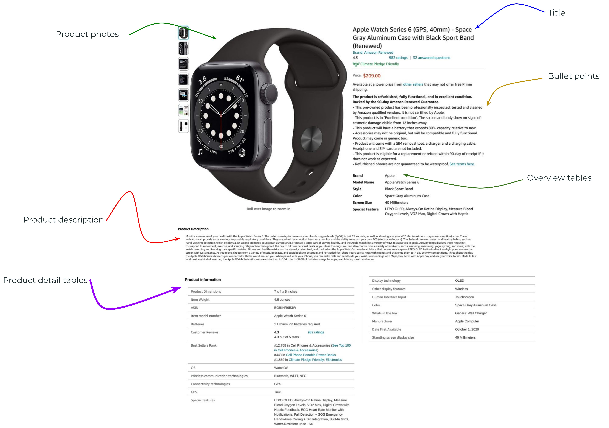
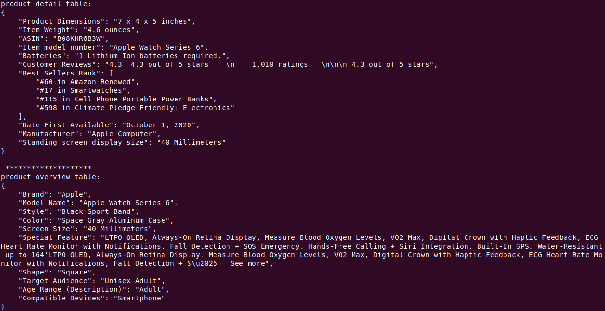

# Amazon Textual and TAbulaR Information extractIon (ATTARII)

# Intro
Amazon e-commerce products contain rich sources of information spread over text and tables. **A**mazon **T**extual and **TA**bula**R** **I**nformation extract**I**on (**ATTARII**) can effectively scrape Amazon product web pages and extract sections of interest. These sections on Amazon web pages are divided into two categories:
- Textual information
  - Product titles
  - Bullet points
  - Product descriptions
- Tabular information
  - Product detail tables
  - Product overview tables
  
These sections are marked in the figure below:




Given the URL of an Amazon product web page, ATTARII retrieves the web page content by the [webdriver](https://www.geeksforgeeks.org/page_source-driver-method-selenium-python/) of [Selenium library](https://pypi.org/project/selenium/). In the next step, ATTARII parses the HTML content with [Beautiful Soup](https://pypi.org/project/beautifulsoup4/) library, and it extracts the desired sections using HTML tags and ids. There is [an excellent tutorial](https://realpython.com/beautiful-soup-web-scraper-python/#step-2-scrape-html-content-from-a-page) for Beautiful Soup library.

Different suppliers and developers may use different HTML tags and ids to include the product data. The tool that I have developed here is capable of extracting the desired sections for the majority of Amazon products, when I test the tools for [Amazon-PQA dataset](https://registry.opendata.aws/amazon-pqa/).


# Installation
To get started, you'll need Python and pip installed.

1. Clone the Git repository
```
git clone https://github.com/anaeim/ATTARII.git
```

2. Navigate to the project directory
```
cd ATTARII
```

3. Create a directory for the extracted textual and tabular information <br>
   
```
mkdir extracted_info
```

4. Install the requirements
```
pip install -r requirements.txt
```


# Usage
```
python ATTARII.py --URL https://www.amazon.com/dp/B08KHR6B3W/ \
    --info-type tabular \
    --verbosity-enabled \
    --dump-info-enabled \
    --dump-info-path extracted_info
```
The meaning of the flags:
* ``--URL``: the URL of the Amazon product web page
* ``--info-type``: the type of information for extraction by ATTARII. You can choose between ``tabular`` and ``textual`` data.
* ``--verbosity-enabled``: to display the extracted information.
* ``--dump-info-enabled``: to dump and store the extracted information as a ``.JSON`` file.
* ``--dump-info-path``: to specify the directory to dump and store the extracted information.


# Example
Here is an example of extracted tabular info for the [Apple Watch Series 6 on Amazon](https://www.amazon.com/dp/B08KHR6B3W/):

